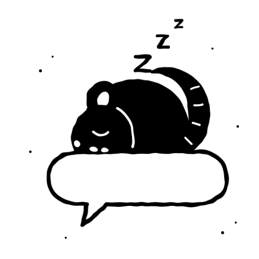

<a id="readme-top"></a>

<!-- PROJECT SHIELDS -->
[![Python][python-shield]][python-url]
[![Ollama][ollama-shield]][ollama-url]
[![Beeper][beeper-shield]][beeper-url]
[![License: MIT][license-shield]][license-url]

<!-- PROJECT LOGO -->
<br />
<div align="center">
  <a href="https://github.com/gautierlp/dormouse">
    <picture>
      <source media="(prefers-color-scheme: dark)" srcset="docs/assets/dormouse-logo-dark.svg">
      
    </picture>
  </a>

  <h1 align="center">dormouse</h1>

  <p align="center">
    <em>It puts quiet chats to sleep. A new message wakes them up. It never sleeps on a question.</em>
    <br />
    <br />
    An hourly job that archives the Beeper chats where nobody is waiting on you.
    <br />
    <a href="#usage"><strong>See what it does »</strong></a>
    <br />
    <br />
    <a href="src/rules.py">Read the rule</a>
    &middot;
    <a href="https://github.com/gautierlp/dormouse/issues/new">Report bug</a>
    &middot;
    <a href="https://github.com/gautierlp/dormouse/issues/new">Request feature</a>
  </p>
</div>

<!-- TABLE OF CONTENTS -->
<details>
  <summary>Table of contents</summary>
  <ol>
    <li>
      <a href="#about-the-project">About the project</a>
      <ul>
        <li><a href="#built-with">Built with</a></li>
      </ul>
    </li>
    <li>
      <a href="#getting-started">Getting started</a>
      <ul>
        <li><a href="#prerequisites">Prerequisites</a></li>
        <li><a href="#installation">Installation</a></li>
        <li><a href="#configuration">Configuration</a></li>
      </ul>
    </li>
    <li><a href="#usage">Usage</a></li>
    <li><a href="#headless-linux">Headless Linux</a></li>
    <li><a href="#how-it-works">How it works</a></li>
    <li><a href="#privacy">Privacy</a></li>
    <li><a href="#faq">FAQ</a></li>
    <li><a href="#roadmap">Roadmap</a></li>
    <li><a href="#contributing">Contributing</a></li>
    <li><a href="#license">License</a></li>
    <li><a href="#contact">Contact</a></li>
    <li><a href="#acknowledgments">Acknowledgments</a></li>
  </ol>
</details>

<!-- ABOUT THE PROJECT -->
## About the project

It is Monday, 9 am. Beeper says 47 chats. Most of them ended on Friday with "ok 👍".
Three of them asked you something, and you cannot find them.

A dormouse goes through the inbox every hour. A chat that has been quiet for 12 hours
goes to sleep in the archive, unless the other person is still waiting on you. A small
model on your own machine reads the last ten messages to decide. When someone writes
again, Beeper wakes the chat up and it is back in your inbox.

Your inbox keeps what you owe. The rest is asleep.

<p align="right">(<a href="#readme-top">back to top</a>)</p>

### Built with

* [![Python][python-shield]][python-url]
* [![Ollama][ollama-shield]][ollama-url]
* [Beeper Desktop API](https://developers.beeper.com/desktop-api/) (local, on `127.0.0.1:23373`)
* [just](https://github.com/casey/just) (command runner)

The script is standard-library Python with no dependencies, the tests included. There
is nothing to `pip install`.

<p align="right">(<a href="#readme-top">back to top</a>)</p>

<!-- GETTING STARTED -->
## Getting started

### Prerequisites

* Python 3.11 or newer
* [Beeper Desktop](https://www.beeper.com/download), signed in, on the machine that runs dormouse
* [Ollama](https://ollama.com) with a small model. Qwen3.5 4B is the default: it runs
  on a CPU and reads French and English well
  ```sh
  ollama pull qwen3.5:4b
  ```
* [just](https://github.com/casey/just), because the commands below use it

The machine has to stay on, because Beeper Desktop is the API. A Mac you close at
night works, but it only tidies while it is open. A small home server is better: see
[Headless Linux](#headless-linux).

### Installation

1. Clone the repo
   ```sh
   git clone https://github.com/gautierlp/dormouse.git ~/dormouse
   cd ~/dormouse
   ```
2. Run the tests
   ```sh
   just test
   ```
3. In Beeper Desktop: Settings, Integrations, "+" next to Approved connections. Copy
   the token. It only works with the Beeper that made it.
4. Create the env file and paste the token in it
   ```sh
   mkdir -p ~/.config/dormouse
   cp env.example ~/.config/dormouse/env
   chmod 600 ~/.config/dormouse/env
   ```

### Configuration

All settings live in `~/.config/dormouse/env`:

| Variable | Default | What it does |
|---|---|---|
| `BEEPER_ACCESS_TOKEN` | none | The token from step 3. Required. |
| `ARCHIVE_ENABLED` | `0` | `1` archives for real. Anything else is a dry run. |
| `BEEPER_ARCHIVE_MODEL` | `qwen3.5:4b` | Any Ollama model that can return JSON. |
| `STATE_DB` | `~/.local/state/dormouse/state.db` | Where the model's verdicts are cached. |

The quiet period (12 hours) and the history size (10 messages) are constants at the
top of `src/rules.py` and `src/dormouse.py`.

<p align="right">(<a href="#readme-top">back to top</a>)</p>

<!-- USAGE -->
## Usage

Start with a dry run. It decides everything and archives nothing:

```sh
just run
```

```
WOULD-ARCHIVE [sent-by-me] Léa | parfait, à jeudi alors
WOULD-ARCHIVE [no-reply-needed] Climbing crew | haha trop bien
WOULD-ARCHIVE [no-reply-needed] Bank | Your statement is ready
done: 212 chats, 29 archived (dry-run, model qwen3.5:4b)
```

Read the list. If nothing on it still needs you, set `ARCHIVE_ENABLED=1` and run it
every hour (systemd units are in `deploy/linux/`).

### Before / after

Your inbox at 9 am:

```
Sam            tu viens samedi ?
Léa            parfait, à jeudi alors
Climbing crew  haha trop bien
Bank           Your statement is ready
Mum            Did you see the photos? 😂
```

What the dormouse leaves you:

```
Sam            tu viens samedi ?
Mum            Did you see the photos? 😂
```

Mum's last message is a laugh, but the message before it is a question. The model
reads both.

<p align="right">(<a href="#readme-top">back to top</a>)</p>

<!-- HEADLESS LINUX -->
## Headless Linux

On a server with no screen, Beeper Desktop runs on a virtual display.

1. Install the virtual display, a VNC server for the one-time sign-in, and the desktop
   libraries Electron needs (Ubuntu 24.04 names):
   ```sh
   sudo apt-get install -y xvfb x11vnc libfuse2t64 libasound2t64 libatk1.0-0t64 \
     libatk-bridge2.0-0t64 libatspi2.0-0t64 libcairo2 libcups2t64 libgtk-3-0t64 libpango-1.0-0
   ```
2. Put the Beeper AppImage at `~/apps/beeper/Beeper.AppImage`, copy the four units from
   `deploy/linux/` to `~/.config/systemd/user/`, then
   ```sh
   loginctl enable-linger $USER
   systemctl --user daemon-reload
   systemctl --user enable --now xvfb beeper-desktop
   ```
3. Sign in once over VNC, tunnelled through SSH. macOS Screen Sharing refuses a VNC
   server with no password, so set a throwaway one:
   ```sh
   # on the server
   x11vnc -storepasswd <throwaway> ~/.vnc-tmp-pass
   x11vnc -display :99 -localhost -forever -rfbauth ~/.vnc-tmp-pass -bg
   # on your laptop
   ssh -N -L 5901:127.0.0.1:5900 <server> &
   open vnc://127.0.0.1:5901
   ```
   Sign in, approve the new device from your phone, and make the API token in this
   window. Then `pkill -x x11vnc; rm ~/.vnc-tmp-pass`. Beeper keeps its login across
   restarts.
4. Turn on the hourly run:
   ```sh
   systemctl --user enable --now dormouse.timer
   journalctl --user -u dormouse -o cat | grep ARCHIVE
   ```

<p align="right">(<a href="#readme-top">back to top</a>)</p>

<!-- HOW IT WORKS -->
## How it works

Once an hour, `src/dormouse.py` lists every chat from the Beeper API and asks one
question per chat: does the owner still owe an answer?

1. **Archived or pinned:** skip it.
2. **A message in the last 12 hours:** keep it. The conversation is still going.
3. **You sent the last message:** archive it. The ball is in their court.
4. **They acted last:** read the last 10 real messages. Reactions and hidden events
   do not count, so a thumbs up on your message leaves the ball in their court and the
   chat is archived.
5. **They wrote last:** ask the model. It gets the chat type and those 10 messages,
   oldest first, as `Me: ...` and `Léa: ...`, with `[image]` or `[voice]` for a message
   with no text. Ollama forces the answer into `{"needs_reply": true}` or `false`.

Each verdict is cached in SQLite against the chat and the time of its last message,
so a message is judged once, not once an hour. Any failure (the model times out,
Beeper is down, one chat has bad data) keeps the chat in the inbox and moves on to the
next one.

Beeper itself does the waking up: a new message in an archived chat moves it back to
the inbox.

<p align="right">(<a href="#readme-top">back to top</a>)</p>

<!-- PRIVACY -->
## Privacy

Your messages never leave the machine.

* Beeper Desktop API: local only, `127.0.0.1:23373`, remote access off.
* The model: Ollama on `127.0.0.1:11434`. No cloud model, by design. A cheaper hosted
  one exists, and it would see every message you get.
* Logs: one line per archived chat, with the chat name and the first 80 characters of
  the last message. They stay in your local journal.
* Token: in `~/.config/dormouse/env`, `chmod 600`, never in the repo.

<p align="right">(<a href="#readme-top">back to top</a>)</p>

<!-- FAQ -->
## FAQ

**Will it archive a chat where I still owe an answer?**
Sometimes. A 4B model gets some of them wrong. Two things make that cheap: the dry run
shows you its picks before it touches anything, and the other person's next message
brings the chat back.

**Does it delete anything?**
No. It archives, and that is all it can do. Every chat is one tap away.

**Why not Claude or GPT? They would judge better.**
They would. They would also read every message you receive. A small local model is
good enough to tell "ok 👍" from "tu viens samedi ?".

**How slow is it?**
One verdict takes 10 to 20 seconds on a 2018 office PC with no GPU. The first run
judges every old chat and takes a few minutes. After that, an hourly run takes
seconds, because it only judges new messages.

**Why a dormouse?**
It sleeps through seven months of the year and wakes up the moment things warm up.
That is the whole design. It also fits in a teacup, which is roughly how a 4B model
feels on a CPU.

<p align="right">(<a href="#readme-top">back to top</a>)</p>

<!-- ROADMAP -->
## Roadmap

- [x] Archive rule: quiet for 12 hours and nothing owed
- [x] Local model with the last 10 messages as context
- [x] Dry run by default, verdict cache
- [x] Headless Linux with systemd units
- [ ] A launchd agent for macOS
- [ ] Skip chosen networks or chats (work Slack, family group)
- [ ] A morning summary of what it put to sleep

See the [open issues](https://github.com/gautierlp/dormouse/issues) for the rest.

<p align="right">(<a href="#readme-top">back to top</a>)</p>

<!-- CONTRIBUTING -->
## Contributing

Contributions are welcome. The project uses TDD: write the test, watch it fail, then
write the code. Run the suite before you open a PR.

```sh
just test          # or: PYTHONPATH=src python3 -m unittest discover -s tests -v
```

1. Fork the project
2. Create your feature branch (`git checkout -b feat/amazing-feature`)
3. Commit your changes (`git commit -m 'feat: add amazing feature'`)
4. Push to the branch (`git push origin feat/amazing-feature`)
5. Open a pull request

<p align="right">(<a href="#readme-top">back to top</a>)</p>

<!-- LICENSE -->
## License

Distributed under the MIT License. See [`LICENSE`](LICENSE).

<p align="right">(<a href="#readme-top">back to top</a>)</p>

<!-- CONTACT -->
## Contact

Gautier Le Poher - gautier@lepoher.co

Project link: [https://github.com/gautierlp/dormouse](https://github.com/gautierlp/dormouse)

<p align="right">(<a href="#readme-top">back to top</a>)</p>

<!-- ACKNOWLEDGMENTS -->
## Acknowledgments

* [Beeper Desktop API](https://developers.beeper.com/desktop-api/)
* [Ollama](https://ollama.com)
* [Qwen](https://github.com/QwenLM)
* [just](https://github.com/casey/just)
* [Shields.io](https://shields.io)

<p align="right">(<a href="#readme-top">back to top</a>)</p>

<!-- MARKDOWN LINKS & IMAGES -->
[python-shield]: https://img.shields.io/badge/Python-3.11+-3776AB?style=for-the-badge&logo=python&logoColor=white
[python-url]: https://www.python.org/
[ollama-shield]: https://img.shields.io/badge/Ollama-local-000000?style=for-the-badge&logo=ollama&logoColor=white
[ollama-url]: https://ollama.com
[beeper-shield]: https://img.shields.io/badge/Beeper-Desktop%20API-6E56CF?style=for-the-badge
[beeper-url]: https://developers.beeper.com/desktop-api/
[license-shield]: https://img.shields.io/badge/License-MIT-yellow?style=for-the-badge
[license-url]: #license
